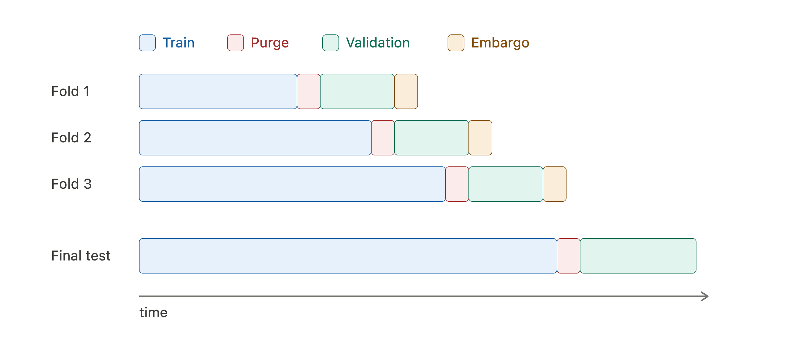

# Walk-forward + Purge / Embargo 验证框架

本文档说明一个适合金融时间序列预测任务的验证框架：

\[
\boxed{
\text{Walk-forward Validation} + \text{Purging} + \text{Embargo} + \text{Final Hold-out Test}
}
\]

这个框架适用于预测未来 \(h\) 天股票相对收益、构建交易信号、并进行样本外回测的任务。

---

## 1. 整体结构

下面这张图展示了一次 **walk-forward 滚动验证** 的完整结构。每一行是一折（fold），时间从左到右流动。



每一折的顺序是：

```text
Train → Purge → Validation → Embargo
```

对应图中的颜色：

| 区域 | 含义 |
|---|---|
| Blue / Train | 用于模型训练 |
| Red / Purge | 删除训练集尾部会产生标签泄漏的样本 |
| Teal / Validation | 用于调参、模型选择、评估信号稳定性 |
| Amber / Embargo | 验证集之后的缓冲区，避免验证信息通过自相关泄漏到后续训练 |

需要注意：

- **Purge 永远夹在 Train 和 Validation 之间**。
- **Embargo 永远位于 Validation 之后**。
- 随着 fold 往后推进，训练窗口逐渐扩张，验证窗口不断向未来移动。
- 这个过程模拟的是：站在某个历史时点，只使用过去已知数据训练模型，然后预测未来。

---

## 2. 为什么使用 Walk-forward，而不是一次性切分？

简单静态切分通常是：

```text
Train:      2000–2018
Validation: 2019–2021
Test:       2022–2025
```

这种方法容易解释，但对金融预测不够稳健。

原因是金融市场存在明显的 regime shift。一个模型如果只在某一个验证阶段表现好，可能只是偶然适应了那一段市场环境。Walk-forward 的优势是可以在多个时间段上反复检查模型表现。

Walk-forward 更接近真实交易部署：

\[
\text{用过去训练} \rightarrow \text{预测未来} \rightarrow \text{加入新数据} \rightarrow \text{重新训练}
\]

因此，它比单次 train / validation / test 划分更适合评估交易信号的样本外稳定性。

---

## 3. 为什么要 Purge？

### 3.1 标签使用了未来信息

如果目标是未来 \(h\) 天收益，例如未来 5 日收益：

\[
y_t = \frac{P_{t+5}}{P_t} - 1
\]

那么样本 \(t\) 的标签并不是只依赖 \(t\) 当天的信息，而是依赖未来区间：

\[
[t, t+h]
\]

这会带来一个边界问题。

---

### 3.2 边界附近的训练样本会泄漏验证期信息

假设：

```text
Train ends:       2022-12-31
Validation starts:2023-01-01
Prediction horizon h = 5 trading days
```

如果某个训练样本的日期是：

```text
t = 2022-12-29
```

它的标签会用到：

```text
2022-12-29 → 2023-01-05
```

此时，虽然特征 \(X_t\) 属于训练期，但标签 \(y_t\) 已经使用了验证期价格。

这就是：

\[
\text{label leakage}
\]

或者：

\[
\text{look-ahead bias}
\]

---

### 3.3 Purge 的规则

为了避免这种泄漏，需要删除训练集尾部那些标签区间会跨入验证集的样本。

如果标签 horizon 是 \(h\)，则删除满足下面条件的训练样本：

\[
t + h > T_{\text{train end}}
\]

更直观地说：

```text
样本 A：离边界远
● ── 未来 h 天标签 ──▶
标签终点仍在训练区
→ 保留

样本 B：贴近边界
● ── 未来 h 天标签 ──▶
标签终点落入验证区
→ 删除
```

因此：

\[
\text{purge width} \approx h
\]

如果预测未来 5 天收益：

\[
h = 5
\]

那么通常至少 purge 掉训练集尾部 5 个交易日附近的样本。

---

## 4. 为什么要 Embargo？

### 4.1 金融时间序列存在自相关

金融数据不是独立同分布的。相邻日期之间可能存在：

- 收益自相关；
- 波动率聚集；
- 因子暴露延续；
- 事件影响持续；
- 持仓和成交行为的惯性。

因此，验证期之后紧跟着的一小段数据，可能仍然携带验证期的信息。

---

### 4.2 Embargo 防止验证信息进入后续训练

在 walk-forward 中，某一折的验证期之后的数据，可能会在后续折里变成训练数据。

如果验证期后面紧接着的数据立刻被加入下一折训练，验证期的信息可能通过时间自相关泄漏到后续训练中。

所以需要在验证集后面留出一段缓冲区：

```text
Validation → Embargo → Future trainable data
```

Embargo 区间不用于当前验证，也不立即用于后续训练。

---

### 4.3 Embargo 的宽度如何选择？

Embargo 的宽度通常和自相关衰减长度有关。

对于日频股票数据，可以采用经验设置：

\[
\text{embargo width} = 5 \sim 10 \text{ trading days}
\]

如果策略持仓周期更长，或者特征使用了较长的移动窗口，可以适当增加 embargo。

常见选择：

| 预测 / 持仓周期 | 建议 embargo |
|---|---|
| 1 日预测 | 1–5 个交易日 |
| 5 日预测 | 5–10 个交易日 |
| 10–20 日预测 | 10–20 个交易日 |
| 月频信号 | 1 个月左右 |

在本项目中，如果目标是未来 5 日相对收益，一个稳妥选择是：

\[
\text{purge} = 5 \text{ trading days}, \quad \text{embargo} = 5 \sim 10 \text{ trading days}
\]

---

## 5. Final Hold-out Test

Walk-forward folds 主要用于：

- 模型选择；
- 特征选择；
- 超参数调整；
- 检查不同市场阶段下的稳定性。

但是，只要你根据这些验证结果选择了模型，验证结果本身就已经参与了决策过程。因此，fold 内的结果通常会略微偏乐观。

所以需要保留最后一段从未被使用过的数据作为 **Final Hold-out Test**。

示例：

```text
2005–2020:
Walk-forward training / validation / model selection

2021–2024:
Walk-forward out-of-sample backtest

2025–now:
Final untouched hold-out test
```

最终报告中的核心样本外数字，应来自这个 final hold-out 区间。

---

## 6. 推荐的完整数据切分方案

一个可操作的方案如下：

```text
Fold 1:
Train:      2005–2014
Purge:      train end 后的 h 天边界样本
Validation: 2015
Embargo:    validation 后 5–10 个交易日

Fold 2:
Train:      2005–2015
Purge:      train end 后的 h 天边界样本
Validation: 2016
Embargo:    validation 后 5–10 个交易日

Fold 3:
Train:      2005–2016
Purge:      train end 后的 h 天边界样本
Validation: 2017
Embargo:    validation 后 5–10 个交易日

...

Final test:
Train:      all previous available data
Purge:      final train end 后的 h 天边界样本
Test:       final untouched period
```

如果数据从 2000 年开始，也可以把 2000–2004 作为特征 warm-up 或初始训练期，正式 walk-forward 从 2005 年开始。

---

## 7. 和 sklearn TimeSeriesSplit 的区别

`sklearn.model_selection.TimeSeriesSplit` 是这套方法的简化版。

它可以做到：

```text
Train → Validation
```

但默认不处理：

```text
Purge
Embargo
```

所以如果直接使用 `TimeSeriesSplit`，在金融任务中仍然可能发生信息泄漏。

更安全的做法是：

1. 使用 `TimeSeriesSplit` 生成初始时间切分；
2. 手动删除训练集尾部的 purge 区间；
3. 手动跳过验证集后面的 embargo 区间；
4. 再训练和验证模型。

也可以使用 `mlfinlab` 中的 `PurgedKFold`，它实现了 López de Prado 提出的 purge + embargo 思路。

---

## 8. 伪代码结构

```python
for fold in walk_forward_folds:
    train_start, train_end = fold.train_period
    val_start, val_end = fold.validation_period

    # 1. Initial train / validation split
    train_data = data[(data.date >= train_start) & (data.date <= train_end)]
    val_data = data[(data.date >= val_start) & (data.date <= val_end)]

    # 2. Purge training samples whose label horizon overlaps validation
    train_data = train_data[
        train_data["label_end_date"] < val_start
    ]

    # 3. Embargo after validation
    embargo_end = val_end + pd.Timedelta(days=embargo_days)

    # In later folds, samples inside the embargo period should not be used as training data
    # depending on how folds are constructed.

    # 4. Train model
    model.fit(train_data[features], train_data[target])

    # 5. Validate model
    pred = model.predict(val_data[features])
    evaluate(pred, val_data[target])
```

更严格的判断方式是基于每个样本的标签结束日期：

\[
\text{label\_end\_date}_i < \text{validation\_start}
\]

只保留满足这个条件的训练样本。

---

## 9. 报告中可以直接使用的英文表述

> I adopt an expanding walk-forward validation framework with purging and embargo. Each fold trains the model using only past data and evaluates it on a future validation block. Since the target is a forward \(h\)-day relative return, I purge training samples near the validation boundary whose label horizon overlaps with the validation period. This prevents label leakage and look-ahead bias. I also apply an embargo period after each validation block to reduce potential information leakage caused by serial dependence in financial time series. After model and hyperparameter selection, I reserve a final untouched hold-out period for the final out-of-sample backtest.

---

## 10. 结论

本项目推荐使用：

\[
\boxed{
\text{Expanding Walk-forward Validation}
+ \text{Purging}
+ \text{Embargo}
+ \text{Final Hold-out Test}
}
\]

相比一次性静态切分，这种方法更符合金融交易中的真实部署逻辑，也更能检验信号是否具有稳定、可泛化的预测能力。
